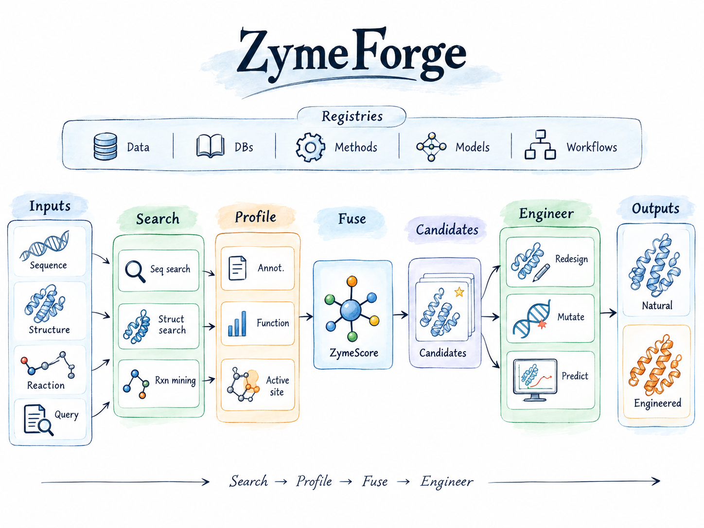

# Architecture



ZymeForge separates stable domain contracts from rapidly changing scientific tools. Workflows depend on capabilities—not package-specific APIs—so providers can be added or replaced without rewriting orchestration logic.

## Package boundaries

| Package | Responsibility |
|---|---|
| `input_data` | normalize reactions, sequences, structures, and identifiers |
| `database` | access reaction, sequence, and structure resources |
| `search` | reaction-, sequence-, and structure-based retrieval |
| `function` | annotation, catalytic site, specificity, kinetics, and developability |
| `structure_prediction` | structure and complex prediction adapters |
| `fusion` | evidence calibration, aggregation, and ranking |
| `engineer` | mutation optimization and sequence redesign |
| `output` | JSON, TSV, and report serialization |
| `workflow` | executable dependency graphs |
| `registry` | capability discovery and adapter lifecycle |

## Dependency direction

```text
CLI / Web / Workflows
          ↓
Typed registries and protocols
          ↓
Stable core domain models
          ↑
External adapters and model runners
```

The workflow layer never needs to import the implementation details of CLEAN, Rhea, Foldseek, or another provider. It requests the relevant capability and consumes normalized records.

For the complete design specification, see the repository's [English architecture](https://github.com/Gabriel-QIN/ZymeForge/blob/master/ARCHITECTURE.md) or [中文架构](https://github.com/Gabriel-QIN/ZymeForge/blob/master/ARCHITECTURE.zh-CN.md).
